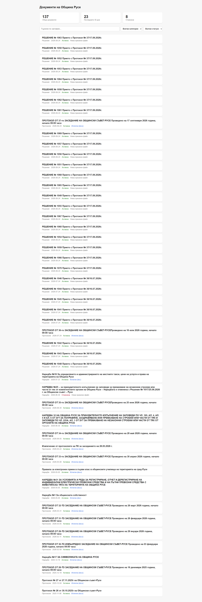

# Ruse Documents Pipeline

A data pipeline that scrapes public municipal documents from the Ruse Municipal Council website, cleans and structures the data, loads it into a PostgreSQL warehouse, and serves it through a searchable dashboard.



## Live Demo

Dashboard: https://ruse-documents-pipeline.vercel.app
API: https://ruse-documents-pipeline.onrender.com/api/stats

The API runs on Render's free tier, which spins down after periods of inactivity. The first request after idle time can take thirty to sixty seconds to respond while it wakes up, this is a known characteristic of free hosting, not a bug.

## What This Project Is

Ruse municipality publishes regulations, council decisions, and meeting minutes on its website, but the site has no unified search, inconsistent file formats, and documents scattered across multiple content types. This project builds a pipeline that pulls this data, cleans it, and makes it searchable in one place.

This is a Data Engineering portfolio project. The focus is the pipeline itself, extraction, transformation, orchestration, and storage, not the dashboard, which is intentionally simple.

## Architecture

```
Ruse Council Site (obs.ruse-bg.eu)
        |
   Extract: Python scraper (requests + BeautifulSoup)
        |
        v
Raw storage: local JSON files, one per scrape run
        |
   Orchestration: Airflow DAG
        |
   Transform: clean titles, parse dates, detect status, deduplicate
        |
        v
   Load: PostgreSQL, star schema
        |
   API: FastAPI backend reading from Postgres, deployed on Render
        |
        v
   Frontend: static dashboard on Vercel, live search, filters, and pagination
```

## Data Source Handling

Regulations and meeting minutes use a custom document post type with consistent HTML classes. Council decisions use a separate category with no matching HTML structure, instead exposing clean JSON-LD structured data embedded in the page, which the scraper parses directly.

Real inconsistencies handled by the pipeline:

- Two different date formats across categories, one plain text day and month and year format, one ISO format
- File attachments in doc, docx, and pdf formats, and some documents with no attachment at all
- Regulation titles that embed their repeal status as free text rather than structured data, for example a title containing "Отменена с Решение № 1017"
- Duplicate entries caused by the site rendering the same document in both a main list and a sidebar widget

## Known Limitations

- Status detection, active versus repealed, currently only works reliably for Наредби, since that category's titles follow a consistent phrasing pattern the detector recognizes. Решения and Протоколи default to active, since nothing in the current logic classifies them.
- A full historical scrape of Решения runs several hundred sequential requests to the source site and can occasionally hit a connection timeout partway through. Retry logic handles transient failures, but a full run is not perfectly reliable end to end every time.
- The API allows requests from any origin. Acceptable for a small public read only dataset like this, but worth noting as a deliberate simplification rather than an oversight.

## Database Schema

Star schema. One fact table, two dimension tables.

**documents** (fact table)
id, title, category_id, status_id, publish_date, file_url, file_type, file_size_kb, source_url, scraped_at

**categories** (dimension table)
Наредби, Решения, Протоколи, Предложения, Приватизация

**statuses** (dimension table)
active, repealed, unknown

## Tech Stack

- Python, requests and BeautifulSoup for extraction
- PostgreSQL for storage, Neon for the hosted production database
- Apache Airflow for scheduling and orchestration
- FastAPI for the backend API, deployed on Render
- Plain HTML, CSS, and JavaScript for the dashboard, no framework, deployed on Vercel

## Running This Locally

Requirements: Python 3.12, PostgreSQL, WSL or a Linux environment.

Clone the repository and set up the environment.

```bash
git clone https://github.com/YourGothDaddy/ruse-documents-pipeline.git
cd ruse-documents-pipeline
python3 -m venv venv
source venv/bin/activate
pip install -r requirements-dev.txt
```

`requirements-dev.txt` includes everything needed for local development, extraction, transformation, loading, and Airflow. The deployed API on Render uses a separate, smaller file, `requirements-api.txt`, containing only what the API itself needs.

Create a `.env` file with your database credentials.

```
DB_HOST=localhost
DB_NAME=ruse_documents
DB_USER=ruse_pipeline
DB_PASSWORD=your_password
```

Create the database and run the schema.

```bash
psql -U ruse_pipeline -d ruse_documents -h localhost -f sql/schema.sql
```

Run the pipeline manually, one step at a time:

```bash
python3 src/extract/scraper.py
python3 src/transform/clean.py
python3 src/load/load.py
```

Run the API:

```bash
cd ~/projects/ruse-documents
uvicorn src.api.main:app --reload --port 8000
```

Serve the frontend through a local web server rather than opening the file directly, since browsers apply extra restrictions to pages loaded via a raw file path.

```bash
cd frontend
python3 -m http.server 5500
```

Open `http://localhost:5500`. By default the frontend points at the live Render API, edit `API_BASE` in `frontend/index.html` if you want it to talk to your local API instead.

## Planned: V2

- Full text extraction from document files, including OCR for scanned documents
- Full text search across document contents, not just titles
- Status detection expanded beyond Наредби
- More resilient full archive scraping for Решения, to handle the occasional timeout without requiring a manual rerun

## Project Structure

```
src/extract/     scraper
src/transform/   cleaning and validation logic
src/load/        database loading logic
src/api/         FastAPI backend
dags/            Airflow DAG
sql/             schema definition
frontend/        static dashboard
data/            local raw and processed data, gitignored
```
